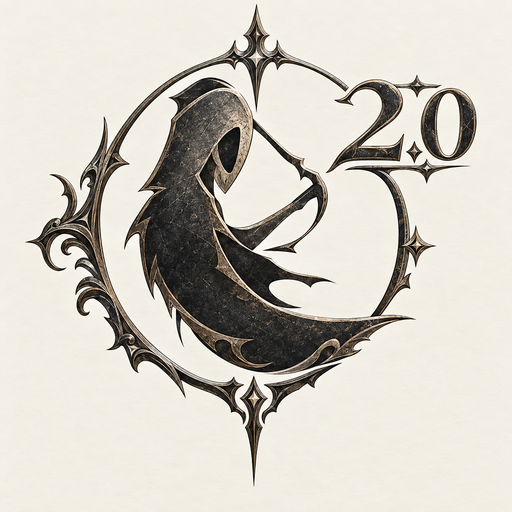

# Fantasy Player Improved



A Dalamud plugin to control your music from within FFXIV, Also includes a free music provider (no Spotify / no Premium) that plays your own music files and internet radio through a local MPD daemon.

Fork of [Critical-Impact/FantasyPlayer](https://github.com/Critical-Impact/FantasyPlayer) with:
- Manual login fallback: paste the callback URL/code directly, or click **Paste & Complete Login** to read it from your clipboard.
- Bigger paste box (full callback URLs fit).
- Fixed button/input layout (no more overlapping widgets).
- New icon.
- Free music provider: play local files + internet radio via MPD, no Spotify or Premium required.

## Install in-game

1. Open your Dalamud plugin window (`/xlplugins`).
2. Click the gear icon → **Third-Party Repositories**.
3. Add this repository URL:

```
https://raw.githubusercontent.com/sammiecrafted/FantasyPlayer2.0/main/repo.json
```

(Alternative mirrored CDN, note it can lag behind new releases: `https://cdn.jsdelivr.net/gh/sammiecrafted/FantasyPlayer2.0@main/repo.json`)

4. In the **Available Plugins** tab, search **Fantasy Player Improved** and install it.

## Setup

Spotify now requires you to bring your own app. Follow [SETUP.md](./SETUP.md) to create a Spotify Developer app and get your Client ID. (NOTE YOU MUST HAVE SPOTIFY PREMIUM IN ORDER TO CONNECT YOUR ACCOUNT TO LISTEN) 

## Building

```sh
dotnet build FantasyPlayer/FantasyPlayer.csproj -c Release
```

## Current version

[View releases](https://github.com/sammiecrafted/FantasyPlayer2.0/releases)

## Library Used

[SpotifyAPI-NET](https://github.com/JohnnyCrazy/SpotifyAPI-NET)
